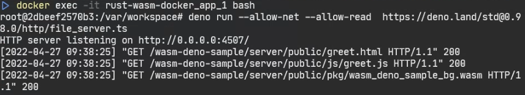

# Rust-wasm-docker

Build Rust wasm in a docker environment

## Developing

Run the following command :

```
git clone git@github.com:koukemo/rust-wasm-docker.git
```

## Build & Tests

Run the following command :

```
cd rust-wasm-docker
docker-compose up -d --build
```

Entering the Container

```
docker exec -it rust-wasm-docker_app_1 bash
```

Runs in a container

```
deno run --allow-net --allow-read  https://deno.land/std@0.136.0/http/file_server.ts
```

If you browse the following link from your browser messages will be displayed. <br>
http://localhost:4507/wasm-deno-sample/server/public/greet.html

### Results




## References

- [WebブラウザでWebAssemblyをDeno(TypeScript)で書いたコードで読み込む - Qiita](https://qiita.com/nabezokodaikon/items/37a35cfff0d3ab95b16b)
